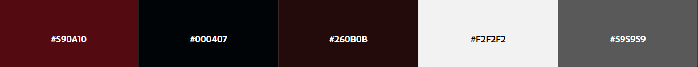

# Batman Begins

Réalisation d'une page web pour présenter le film Batman Begins. L'objectif de ce projet était d'apprendre l'utilisation des langages HTML5 et CSS3, ainsi que 
l'utilisation des listes et des nth-child pour alterner un effet.
  
Charte graphique : 

Charte typographique :  
Monserrat sans-serif 16px.

[Lien vers le github du projet](https://bastienu.github.io/batmanBegins/)